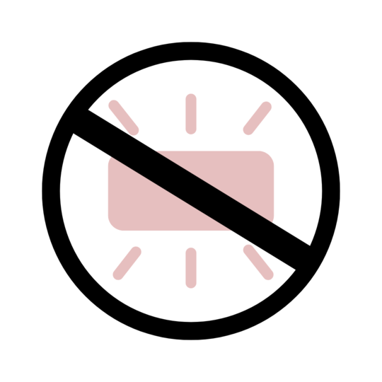

  

 

<ul style="list-style: none">
<h1>Disable Ambient Mode on YouTube</h1>
</ul>

  
  
  

 

---

### This Chrome extension automatically disables the Ambient Mode on YouTube videos and even hides it if you hate it that much.

## Features
 1. Disable Ambient Mode on YouTube
 2. Hide/Show the menu item in settings

## Need?

The Ambient Mode stays off once turned off now, which was fixed recently after an update. However, it still turns on by default in **Incognito mode**. Although it doesn't consume much resources, I see no point in forcing a choice upon us that adds little to no value, especially when using YouTube for **long video content**.

For an average PC build, the following are the estimates:
 - CPU Usage: +2-4%
 - RAM Usage: +30-60MB
 - Integrated GPU Usage: +5-10%
 - Power Consumption: +5-8% increase (noticeable on battery)
 - Reportedly noticeable stutter when watching at 4K

 ## Other solutions?

 There are other solutions but most of them just hide the css which doesn't stop YouTube from doing the calculations (I believe). In our approach we find the element, disable the Ambient Mode from Settings and *actually* turn it off.
